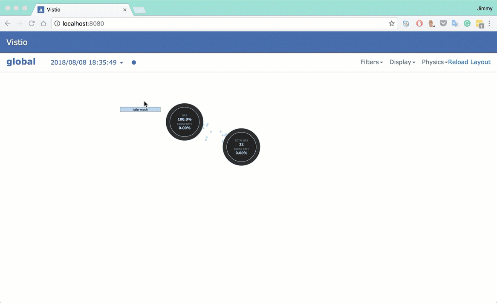

# 使用Vagrant和VirtualBox在本地搭建分布式的Kubernetes集群和Istio Service Mesh

[Setting up a Kubernetes cluster along with Istio service mesh locally with Vagrant and VirtualBox - English](README.md)

当我们需要在本地开发时，更希望能够有一个开箱即用又可以方便定制的分布式开发环境，这样才能对Kubernetes本身和应用进行更好的测试。现在我们使用[Vagrant](https://www.vagrantup.com/)和[VirtualBox](https://www.virtualbox.org/wiki/Downloads)来创建一个这样的环境。

**注意**：因为使用虚拟机创建分布式Kubernetes集群比较耗费资源，所以我又仅使用Docker创建Standalone的Kubernetes的轻量级[Cloud Native Sandbox](https://github.com/rootsongjc/cloud-native-sandbox)。

## Demo

点击下面的图片观看视频。

[](https://www.bilibili.com/video/av39514214/)

## 准备环境

需要准备以下软件和环境：

- 8G以上内存
- Vagrant 2.0+
- VirtualBox 5.0 +
- 提前下载Kubernetes 1.9以上版本（支持最新的1.13.0）的release压缩包
- Mac/Linux，**Windows不完全支持，仅在windows10下通过**

## 集群

我们使用Vagrant和Virtualbox安装包含3个节点的kubernetes集群，其中master节点同时作为node节点。

| IP           | 主机名   | 组件                                       |
| ------------ | ----- | ---------------------------------------- |
| 192.168.101.101 | node1 | kube-apiserver、kube-controller-manager、kube-scheduler、etcd、kubelet、docker、flannel、dashboard |
| 192.168.101.102 | node2 | kubelet、docker、flannel、traefik           |
| 192.168.101.103 | node3 | kubelet、docker、flannel                   |

**注意**：以上的IP、主机名和组件都是固定在这些节点的，即使销毁后下次使用vagrant重建依然保持不变。

容器IP范围：172.33.0.0/30

Kubernetes service IP范围：10.254.0.0/16

## 安装的组件

安装完成后的集群包含以下组件：

- flannel（`host-gw`模式）
- kubernetes dashboard
- etcd（单节点）
- kubectl
- CoreDNS
- kubernetes（版本根据下载的kubernetes安装包而定，支持Kubernetes1.9+）

**可选插件**

- Heapster + InfluxDB  + Grafana
- ElasticSearch + Fluentd + Kibana
- Istio service mesh
- Helm
- Vistio
- Kiali

## 使用说明

将该repo克隆到本地，下载Kubernetes的到项目的根目录。

```bash
git clone https://github.com/rootsongjc/kubernetes-vagrant-centos-cluster.git
cd kubernetes-vagrant-centos-cluster
```

**注意**：如果您是第一次运行该部署程序，那么可以直接执行下面的命令，它将自动帮你下载 Kubernetes 安装包，下一次你就不需要自己下载了，另外您也可以在[这里](https://kubernetes.io/docs/imported/release/notes/)找到Kubernetes的发行版下载地址，下载 Kubernetes发行版后重命名为`kubernetes-server-linux-amd64.tar.gz`，并移动到该项目的根目录下。

因为该项目是使用 NFS 的方式挂载到虚拟机的 `/vagrant` 目录中的，所以在安装 NFS 的时候需要您输入密码授权。

使用vagrant启动集群。

```bash
vagrant up
```

如果是首次部署，会自动下载`centos/7`的box，这需要花费一些时间，另外每个节点还需要下载安装一系列软件包，整个过程大概需要10几分钟。

如果您在运行`vagrant up`的过程中发现无法下载`centos/7`的box，可以手动下载后将其添加到vagrant中。

**手动添加centos/7 box**

````bash
wget -c http://cloud.centos.org/centos/7/vagrant/x86_64/images/CentOS-7-x86_64-Vagrant-1801_02.VirtualBox.box
vagrant box add CentOS-7-x86_64-Vagrant-1801_02.VirtualBox.box --name centos/7
````

这样下次运行`vagrant up`的时候就会自动读取本地的`centos/7` box而不会再到网上下载。

**Windows 安装特别说明**

执行`vagrant up`之后会有如下提示：
```
G:\code\kubernetes-vagrant-centos-cluster>vagrant up
Bringing machine 'node1' up with 'virtualbox' provider...
Bringing machine 'node2' up with 'virtualbox' provider...
Bringing machine 'node3' up with 'virtualbox' provider...
==> node1: Importing base box 'centos/7'...
==> node1: Matching MAC address for NAT networking...
==> node1: Setting the name of the VM: node1
==> node1: Clearing any previously set network interfaces...
==> node1: Specific bridge 'en0: Wi-Fi (AirPort)' not found. You may be asked to specify
==> node1: which network to bridge to.
==> node1: Available bridged network interfaces:
1) Realtek PCIe GBE Family Controller
2) TAP-Windows Adapter V9
==> node1: When choosing an interface, it is usually the one that is
==> node1: being used to connect to the internet.
    node1: Which interface should the network bridge to?
    node1: Which interface should the network bridge to?
    
```
输入`1`之后按回车继续。（根据自己真实网卡选择，node2、node3同样需要）


node3快要结束的时候可能会有如下错误：
```
node3: Created symlink from /etc/systemd/system/multi-user.target.wants/kubelet.service to /usr/lib/systemd/system/kubelet.service.
    node3: Created symlink from /etc/systemd/system/multi-user.target.wants/kube-proxy.service to /usr/lib/systemd/system/kube-proxy.service.
    node3: deploy coredns
    node3: /tmp/vagrant-shell: ./dns-deploy.sh: /bin/bash^M: bad interpreter: No such file or directory
    node3: error: no objects passed to apply
    node3: /home/vagrant
```

解决方法：

```bash
vagrant ssh node3
sudo -i
cd /vagrant/addon/dns
yum -y install dos2unix
dos2unix dns-deploy.sh
./dns-deploy.sh -r 10.254.0.0/16 -i 10.254.0.2 |kubectl apply -f -
```


### 访问kubernetes集群

访问Kubernetes集群的方式有三种：

- 本地访问
- 在VM内部访问
- Kubernetes dashboard

**通过本地访问**

可以直接在你自己的本地环境中操作该kubernetes集群，而无需登录到虚拟机中。

要想在本地直接操作Kubernetes集群，需要在你的电脑里安装`kubectl`命令行工具，对于Mac用户执行以下步骤：

```bash
wget https://storage.googleapis.com/kubernetes-release/release/v1.11.0/kubernetes-client-darwin-amd64.tar.gz
tar xvf kubernetes-client-darwin-amd64.tar.gz && cp kubernetes/client/bin/kubectl /usr/local/bin
```

将`conf/admin.kubeconfig`文件放到`~/.kube/config`目录下即可在本地使用`kubectl`命令操作集群。

```bash
mkdir -p ~/.kube
cp conf/admin.kubeconfig ~/.kube/config
```

我们推荐您使用这种方式。

**在虚拟机内部访问**

如果有任何问题可以登录到虚拟机内部调试：

```bash
vagrant ssh node1
sudo -i
kubectl get nodes
```

**Kubernetes dashboard**

还可以直接通过dashboard UI来访问：https://192.168.101.101:8443

可以在本地执行以下命令获取token的值（需要提前安装kubectl）：

```bash
kubectl -n kube-system describe secret `kubectl -n kube-system get secret|grep admin-token|cut -d " " -f1`|grep "token:"|tr -s " "|cut -d " " -f2
```

**注意**：token的值也可以在`vagrant up`的日志的最后看到。


只有当你安装了下面的heapster组件后才能看到上图中的监控metrics。


**Windows下Chrome/Firefox访问**

如果提示`NET::ERR_CERT_INVALID`，则需要下面的步骤

进入本项目目录

```
vagrant ssh node1
sudo -i
cd /vagrant/addon/dashboard/
mkdir certs
openssl req -nodes -newkey rsa:2048 -keyout certs/dashboard.key -out certs/dashboard.csr -subj "/C=/ST=/L=/O=/OU=/CN=kubernetes-dashboard"
openssl x509 -req -sha256 -days 365 -in certs/dashboard.csr -signkey certs/dashboard.key -out certs/dashboard.crt
kubectl delete secret kubernetes-dashboard-certs -n kube-system
kubectl create secret generic kubernetes-dashboard-certs --from-file=certs -n kube-system
kubectl delete pods $(kubectl get pods -n kube-system|grep kubernetes-dashboard|awk '{print $1}') -n kube-system #重新创建dashboard
```
刷新浏览器之后点击`高级`，选择跳过即可打开页面。

### 组件

**Heapster监控**

创建Heapster监控：

```bash
kubectl apply -f addon/heapster/
```

访问Grafana

使用Ingress方式暴露的服务，在本地`/etc/hosts`中增加一条配置：

```ini
192.168.101.102 grafana.jimmysong.io
```

访问Grafana：<http://grafana.jimmysong.io>


**Traefik**

部署Traefik ingress controller和增加ingress配置：

```bash
kubectl apply -f addon/traefik-ingress
```

在本地`/etc/hosts`中增加一条配置：

```ini
192.168.101.102 traefik.jimmysong.io
```

访问Traefik UI：<http://traefik.jimmysong.io>


**EFK**

使用EFK做日志收集。

```bash
kubectl apply -f addon/efk/
```

**注意**：运行EFK的每个节点需要消耗很大的CPU和内存，请保证每台虚拟机至少分配了4G内存。

**Helm**

用来部署helm。

```bash
hack/deploy-helm.sh
```

### Service Mesh

我们使用 [istio](https://istio.io) 作为 service mesh。

**安装**

到[Istio release](https://github.com/istio/istio/releases) 页面下载istio的安装包，安装istio命令行工具，将`istioctl`命令行工具放到你的`$PATH`目录下，对于Mac用户：

```bash
wget https://github.com/istio/istio/releases/download/1.0.0/istio-1.0.0-osx.tar.gz
tar xvf istio-1.0.0-osx.tar.gz
mv bin/istioctl /usr/local/bin/
```

在Kubernetes中部署istio：

```bash
kubectl apply -f addon/istio/istio-demo.yaml
kubectl apply -f addon/istio/istio-ingress.yaml
```

**运行示例**

我们开启了Sidecar自动注入。

```bash
kubectl label namespace default istio-injection=enabled
kubectl apply -n default -f yaml/istio-bookinfo/bookinfo.yaml
kubectl apply -n default -f yaml/istio-bookinfo/bookinfo-gateway.yaml
kubectl apply -n default -f yaml/istio-bookinfo/destination-rule-all.yaml
```

在您自己的本地主机的`/etc/hosts`文件中增加如下配置项。

```
192.168.101.102 grafana.istio.jimmysong.io
192.168.101.102 prometheus.istio.jimmysong.io
192.168.101.102 servicegraph.istio.jimmysong.io
192.168.101.102 jaeger-query.istio.jimmysong.io
```

我们可以通过下面的URL地址访问以上的服务。

| Service      | URL                                                          |
| ------------ | ------------------------------------------------------------ |
| grafana      | http://grafana.istio.jimmysong.io                            |
| servicegraph | <http://servicegraph.istio.jimmysong.io/dotviz>, <http://servicegraph.istio.jimmysong.io/graph>,<http://servicegraph.istio.jimmysong.io/force/forcegraph.html> |
| tracing      | http://jaeger-query.istio.jimmysong.io                       |
| productpage  | http://192.168.101.101:31380/productpage                        |

详细信息请参阅：https://istio.io/zh/docs/examples/bookinfo/


### Vistio

[Vizceral](https://github.com/Netflix/vizceral)是Netflix发布的一个开源项目，用于近乎实时地监控应用程序和集群之间的网络流量。Vistio是使用Vizceral对Istio和网格监控的改进。它利用Istio Mixer生成的指标，然后将其输入Prometheus。Vistio查询Prometheus并将数据存储在本地以允许重播流量。

```bash
# Deploy vistio via kubectl
kubectl -n default apply -f addon/vistio/

# Expose vistio-api
kubectl -n default port-forward $(kubectl -n default get pod -l app=vistio-api -o jsonpath='{.items[0].metadata.name}') 9091:9091 &

# Expose vistio in another terminal window
kubectl -n default port-forward $(kubectl -n default get pod -l app=vistio-web -o jsonpath='{.items[0].metadata.name}') 8080:8080 &
```

如果一切都已经启动并准备就绪，您就可以访问Vistio UI，开始探索服务网格网络，访问[http://localhost:8080](http://localhost:8080/) 您将会看到类似下图的输出。



更多详细内容请参考[Vistio—使用Netflix的Vizceral可视化Istio service mesh](http://www.servicemesher.com/blog/vistio-visualize-your-istio-mesh-using-netflixs-vizceral/)。

### Kiali

Kiali是一个用于提供Istio service mesh观察性的项目，更多信息请查看[https://kiali.io](https://kiali.io/)。

在本地该项目的根路径下执行下面的命令：

```bash
kubectl apply -n istio-system -f addon/kiali
```

Kiali web地址：http://192.168.101.101:32439

用户名/密码：admin/admin


**注意**：Kilia使用Jaeger做追踪，请不用屏蔽kilia页面的弹出窗口。

### Weave scope

[Weave scope](https://github.com/weaveworks/scope)可用于监控、可视化和管理Docker&Kubernetes集群，详情见<https://www.weave.works/oss/scope/> 

在本地该项目的根路径下执行下面的命令：

```bash
kubectl apply -f addon/weave-scope
```

在本地的`/etc/hosts`下增加一条记录。

```
192.168.101.102 scope.weave.jimmysong.io
```

现在打开浏览器，访问http://scope.weave.jimmysong.io/


## 管理

除了特别说明，以下命令都在当前的repo目录下操作。

### 挂起

将当前的虚拟机挂起，以便下次恢复。

```bash
vagrant suspend
```

### 恢复

恢复虚拟机的上次状态。

```bash
vagrant resume
```

注意：我们每次挂起虚拟机后再重新启动它们的时候，看到的虚拟机中的时间依然是挂载时候的时间，这样将导致监控查看起来比较麻烦。因此请考虑先停机再重新启动虚拟机。

### 重启

停机后重启启动。

```bash
vagrant halt
vagrant up
# login to node1
vagrant ssh node1
# run the prosivision scripts
/vagrant/hack/k8s-init.sh
exit
# login to node2
vagrant ssh node2
# run the prosivision scripts
/vagrant/hack/k8s-init.sh
exit
# login to node3
vagrant ssh node3
# run the prosivision scripts
/vagrant/hack/k8s-init.sh
sudo -i
cd /vagrant/hack
./deploy-base-services.sh
exit
```

现在你已经拥有一个完整的基础的kubernetes运行环境，在该repo的根目录下执行下面的命令可以获取kubernetes dahsboard的admin用户的token。

```bash
hack/get-dashboard-token.sh
```

根据提示登录即可。

### 清理

清理虚拟机。

```bash
vagrant destroy
rm -rf .vagrant
```

### 注意

仅做开发测试使用，不要在生产环境使用该项目。

## 参考

- [Kubernetes Handbook——Kubernetes中文指南/云原生应用架构实践手册](https://jimmysong.io/kubernetes-handbook)
- [duffqiu/centos-vagrant](https://github.com/duffqiu/centos-vagrant)
- [coredns/deployment](https://github.com/coredns/deployment)
- [Kubernetes 1.8 kube-proxy 开启 ipvs](https://mritd.me/2017/10/10/kube-proxy-use-ipvs-on-kubernetes-1.8/#%E4%B8%80%E7%8E%AF%E5%A2%83%E5%87%86%E5%A4%87)
- [Vistio—使用Netflix的Vizceral可视化Istio service mesh](http://www.servicemesher.com/blog/vistio-visualize-your-istio-mesh-using-netflixs-vizceral/)

**更多[Istio](https://istio.io/zh)和Service Mesh的资讯请访问[ServiceMesher社区](http://www.servicemesher.com)和关注社区的微信公众号。**

<p align="center">
  
</p>

